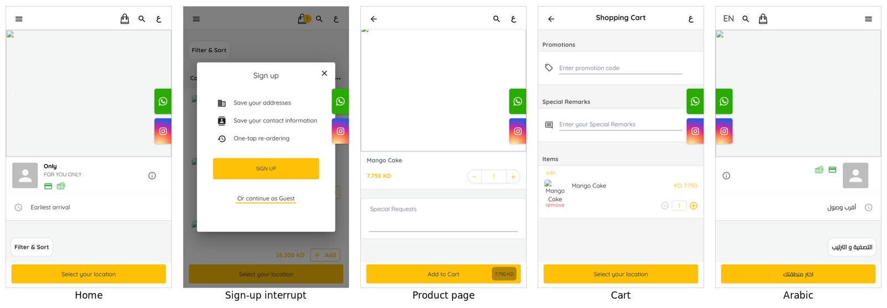
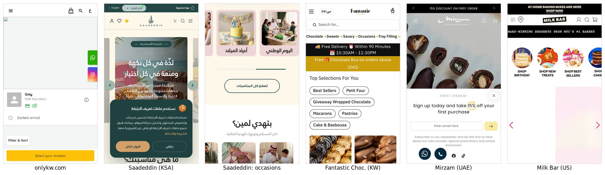
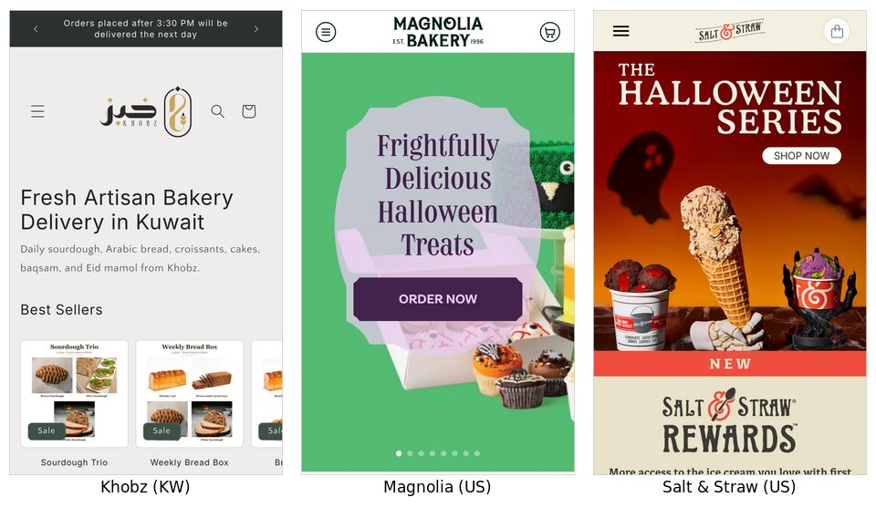
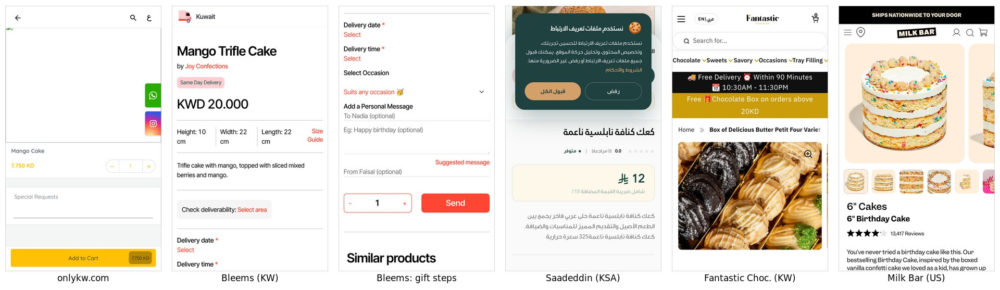
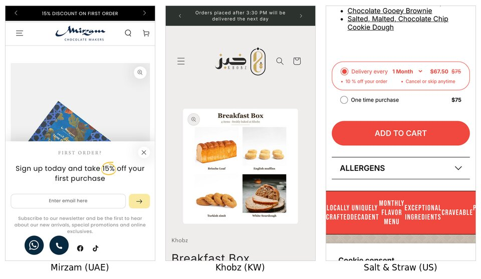
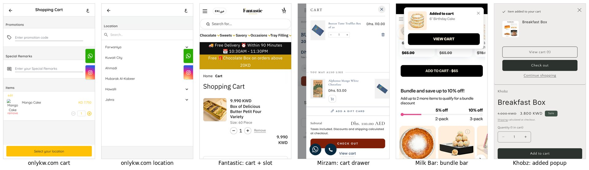

# Website UX Comparison: onlykw.com vs Competitors

### How products are displayed, what the homepage and product pages include, and where competitors are ahead

_Captured live on 2026-10-08 · iPhone 13 viewport (390×664) in headless Chromium · EN + AR_

---

## 1. Executive Summary

onlykw.com runs on **Ordable**, a Kuwaiti ordering-menu SaaS ("powered by ordable/" in the footer). It's a client-rendered React app: the server sends an 8.6 KB empty shell and the content appears after the JavaScript loads.

The site works as a **fast single-page order menu**: 8 products, each with an "Add" button, area selection and guest checkout. It doesn't work as a **store that sells**. Every competitor captured gives the shopper more reasons to buy, more information and more ways to spend more.

**The 10 biggest gaps**, ranked by revenue impact:

| # | Gap | onlykw.com today | Who does it better | Impact |
|---|---|---|---|---|
| 1 | **No delivery promise anywhere** | Only an "Earliest arrival" row; no time, cutoff or fee shown before checkout | Fantastic Chocolate: black bar "🚚 Free Delivery ⏰ Within 90 Minutes · 10:30AM–11:30PM" on every page. Khobz: "Orders after 3:30 PM delivered next day" | 🔴 High |
| 2 | **Product page is nearly empty** | Image, name, price, qty, "Special Requests", Add to Cart. No description, servings, ingredients, storage or reviews | Milk Bar: video, 7 media, serves 6–12, 13,417 reviews, storage, nutrition, Q&A. Saadeddin: price incl. VAT, calories, delivery/pickup/secure-pay box | 🔴 High |
| 3 | **No AOV mechanics** | No free-delivery threshold, gift-with-purchase, bundle discount or add-ons | Fantastic: free chocolate box over 20 KD. Milk Bar: "Bundle and save up to 10%" progress bar with 1-tap ADD. Salt & Straw: subscribe & save 10% | 🔴 High |
| 4 | **Add-to-cart kicks the shopper back to the homepage** | No confirmation, drawer or upsell; only a badge count changes | Mirzam: slide-out drawer with "You may also like" + "Add a gift card". Milk Bar: "Added to cart" toast. Khobz: popup with View cart / Check out | 🔴 High |
| 5 | **Sign-up wall interrupts buying** | "Sign up / Or continue as Guest" sheet appears on add-to-cart, cart and checkout | Competitors allow silent guest checkout. Capture happens through an offer popup (Mirzam: 15% off first order) | 🟠 Med-High |
| 6 | **No gifting flow** | Free-text "Special Requests" only | Bleems: required **delivery date + time**, **occasion picker** (20+ occasions), **To / message / From** with "Suggested message". Fantastic: "Order Notes or Gift Message" on product page | 🟠 Med-High |
| 7 | **No trust or social proof** | No reviews, ratings, press, story or guarantee | Milk Bar: 4.1★ from 13,417 reviews + press quotes. Khobz: Google reviews 4.0 (40+). Saadeddin: "since 1919" heritage | 🟠 Med-High |
| 8 | **No occasion or recipient navigation** | Categories are product types only (Combo / Cake / Ice Cream Bites / Cookies) | Saadeddin: "ما هي مناسبتك؟" (occasion tiles) + "بتهدي لمين؟" (recipient tiles: father, mother, friends, colleagues, kids, corporate) | 🟠 Medium |
| 9 | **Weak SEO and link previews** | Title "Only", meta description "FOR YOU ONLY"; product content not in the HTML | Fantastic Chocolate: keyword titles ("Belgian Chocolate Gifts & Trays"), blog articles, factory story | 🟠 Medium |
| 10 | **No size ladder** | One size per product | Fantastic: 60 / 27-piece variants. Milk Bar: flavour + size. Salt & Straw: pack + delivery frequency | 🟡 Medium |

---

## 2. Method & Caveats

| Item | Detail |
|---|---|
| Sites captured live | onlykw.com, Saadeddin, Fantastic Chocolate, Bleems, Mirzam, Khobz, Milk Bar, Salt & Straw, Magnolia Bakery |
| Partially captured | **Bateel**: page loaded but its styling files were blocked, so only structure was read. **Crumbl**: Next.js app didn't render in the headless browser. **Floward**: bot protection (403). These three are excluded from the visual comparison. |
| What was recorded per site | Mobile screenshots, page text and section order, navigation, buttons, theme/platform fingerprint (e.g. `Shopify.theme`), app scripts, product-page blocks, and add-to-cart behaviour (drawer / popup / redirect) |
| ⚠️ **onlykw.com images** | onlykw.com's product and banner images are hosted on `tapcom-live.ams3.cdn.digitaloceanspaces.com`, which **this research environment blocks**. **Your images show as blank boxes in these screenshots. That's a capture limitation, not a fault on your site.** Layout, text, prices, buttons and flows were captured fully. To refresh the screenshots with images, add that domain to the environment's allowed list. |
| Location bias | Captures came from a data-centre IP, so some sites showed geo prompts (e.g. Bateel "Ship to: India", Magnolia location prompt). |
| Checkout | Walked to the contact-details step only. No orders were placed. |

---

## 3. onlykw.com Today: Teardown



_Images missing in these screenshots because the image CDN was blocked here (see §2)._

### 3.1 Platform & tech

| Item | Finding |
|---|---|
| Platform | **Ordable** (Kuwaiti ordering SaaS). React + Material-UI single-page app; images on Tapcom/DigitalOcean CDN |
| Rendering | Client-side. Initial HTML 8.6 KB with no product content. First price text appeared about **3.0 s** after navigation on a fast data-centre connection; on 4G inside the Instagram/Snapchat in-app browser it will be slower |
| Tracking | Google Tag Manager, Meta Pixel, Snap Pixel, TikTok Pixel detected |
| SEO metadata | `<title>Only</title>`, description "FOR YOU ONLY", OG description "Order online directly from Only" |
| URL pattern | `/product/<category>/<slug>` (e.g. `/product/cake/mango-cake`), `/cart/`, `/checkout/details` |
| Languages | EN + AR toggle ("ع"); Arabic layout mirrors correctly |

### 3.2 Homepage: what it includes (top → bottom)

1. **Header:** ☰ menu · cart bag (with count badge) · search · "ع" language toggle
2. **Banner carousel** (image slides with prev/next arrows)
3. **Brand row:** logo, "Only · FOR YOU ONLY", payment-method icons, ⓘ info
4. **"Earliest arrival"** row (delivery-timing mode)
5. **Filter & Sort** button
6. **Product list**, grouped by category with a list-row layout:
   - **Combo:**
     - Tiramisu cake + Tiramisu bites + Nutella cookies, **26.400 KD**
     - Mango cake + Mango ice-cream bites + Nutella cookies, **22.200 KD**
     - Tiramisu cake + Mango cake + Nutella cookies, **26.200 KD**
   - **Cake:**
     - Mango Cake "Serves 7–9 people", **7.750 KD**
     - Tiramisu Cake "Best Tiramisu in Town!", **11.950 KD**
   - **Ice Cream Bites:** Mango / Tiramisu / Cocoa, each "20 pieces … covered with white/milk chocolate", **7.950 KD**
   - **Cookies:** Nutella Cookies 12 pcs, **6.500 KD**
7. **Floating buttons:** WhatsApp, Instagram
8. **Sticky bottom bar:** "Select your location" (yellow)
9. Footer: "powered by ordable/"

**Missing on the homepage:**
- delivery promise or hours
- free-delivery threshold
- best-sellers or "new" badges
- occasions
- reviews
- brand story
- newsletter or WhatsApp capture
- policies
- corporate/catering entry point

### 3.3 Product display (listing cards)

- **Format:** single-column **list rows**, like a restaurant menu: small thumbnail · name · one-line descriptor · price · `Add` button.
- **Strengths:**
  - Fast to scan
  - One-tap add from the listing
  - Servings shown for the Mango Cake ("Serves 7–9 people")
  - Piece count shown for the bites
- **Weaknesses:**
  - Small images, while competitors use large 1:1 or portrait tiles
  - No badges (best seller, new, ⚡ fast delivery, sale)
  - No ratings
  - Servings shown inconsistently (only on one cake)
  - No price per person
  - Combos named as raw ingredient lists ("Tiramisu cake+Tiramisu bites+Nutella cookies") instead of named boxes
  - **Combos give no saving.** Each combo costs exactly the sum of its items:
    - 11.950 + 7.950 + 6.500 = **26.400 KD**
    - 7.750 + 7.950 + 6.500 = **22.200 KD**
    - 11.950 + 7.750 + 6.500 = **26.200 KD**
  - So there is no incentive to choose a combo over single items

### 3.4 Product page: what it includes

| Block | Present? |
|---|---|
| Back arrow, search, language | ✅ |
| Product image | ✅ single image (2 `` on page, no gallery, no video) |
| Name + price | ✅ "Mango Cake · 7.750 KD" |
| Quantity stepper | ✅ |
| "Special Requests" free-text box | ✅ |
| Sticky "Add to Cart · 7.750 KD" button | ✅ |
| Description / story | ❌ |
| Servings / size options | ❌ (servings appear on the listing only, not the product page) |
| Ingredients / allergens | ❌ |
| Storage & serving instructions ("keep chilled", "best within 48h") | ❌ |
| Delivery info (time, cutoff, fee, areas) | ❌ |
| Reviews / ratings / UGC | ❌ |
| Gift message / card / candles / add-ons | ❌ (only via free-text Special Requests) |
| Related products / "complete the gathering" | ❌ |
| Payment badges (KNET / Apple Pay) | ❌ on page |
| Sign-up interrupt | ⚠️ sheet: "Sign up · Save your addresses · Save your contact information · One-tap re-ordering · SIGN UP · Or continue as Guest" |

### 3.5 Cart & checkout flow

1. **Add to Cart** → redirected back to the homepage. Badge shows "1". No confirmation, drawer or upsell.
2. **Cart page** (`/cart/`):
   - Promotions (promo code field)
   - Special Remarks
   - Items (edit / remove / qty)
   - Sticky "Select your location"
3. **Location sheet:** governorate list (Farwaniya, Kuwait City, Ahmadi, Mubarak Al-Kabeer, Hawalli, Jahra) → area list (e.g. 40+ areas under Kuwait City).
4. **Checkout** (`/checkout/details`): "Contact Information" behind the same Sign up / Guest sheet.

**Missing:**
- free-delivery progress bar
- add-ons / cross-sell
- delivery date & time slot in the cart
- gift toggle / recipient details
- order summary with delivery fee before location
- payment-method reassurance

---

## 4. Homepage Comparison




### 4.1 What each competitor homepage includes

**Saadeddin** (saadeddin.com · KSA · Shopify, Arabic RTL default)

Top bar:
- language toggle
- **branch selector** ("اختر الفرع")
- **"توصيل سريع"** (fast delivery) chip
- secure-payment chip

Header: account · wishlist · **points ⭐** · cart · search · menu.

Sections, top to bottom:
1. Hero carousel (kunafa / ice-cream collections)
2. **"What's your occasion?"** image tiles: National Day, Birthdays, Graduation, Newborn, Wedding → "Browse all occasions"
3. **"Who are you gifting?"** tiles: Father, Mother, Friends, Colleagues, Kids, Corporate gifts
4. **Best sellers this week**, with category chips (All · Kunafa · Cake · Chocolate · Gifts · Cookies) and add-to-cart on each card
5. **Corporate gifts** banner
6. Featured collections ("crafted since 1919")
7. **"Design a cake for your occasion"** step-by-step builder (size → flavour → decoration → your message)
8. Customer reviews CTA

Nav: Home · Products · Occasions · Custom cake (soon) · Hospitality service · Vouchers · Offers · **My points** · Wishlist · Account.

**Fantastic Chocolate** (fantasticchocolatekw.com · Kuwait · Shopify + Searchanise search)

Header: menu · **EN | عربي** · logo · cart. **Visible search bar** "Search for…".

Category tabs: Chocolate · Sweets · Savory · **Occasions** · **Tray Filling**.

Announcement blocks:
- **"🚚 Free Delivery ⏰ Within 90 Minutes · 📆 10:30AM–11:30PM"**
- **"Free 🎁 Chocolate Box on orders above 20KD"**

Sections:
1. "Top Selections For You" chips (Best Sellers · Petit Four · Giveaway Wrapped Chocolate · Macarons · Pastries · Cake & Basbousa) + product grid
2. **Tray Filling Service** (videos / images / trays)
3. **✍️ Articles** blog: "Coffee Sweets in Kuwait — What to Serve with Arabic Coffee", "Savory and Sweet Combos… Sized by Guests"
4. Factory story
5. Footer: WhatsApp 98821515 · Sitemap · Policies · Blogs

Mega menu includes **"Chocolate Snacks Under 10 KD"**, Corporate Branded Chocolate and Giveaway Chocolate.

**Mirzam** (mirzam.com · UAE · Shopify, "Be Yours" theme v8.3.3)

- Rotating announcement bar: Free shipping over 500 AED · **15% discount on first order** · Delivering across the UAE
- Autoplay-video hero
- **First-order popup** (15% off for email) with **WhatsApp + call** floating buttons
- Collections grid (Taste of the UAE · Gifting · Bars & Bites · Cookies & Cakes · Vegan · Kid-friendly · Recipes)
- Brand story "Guided by the star"
- "Other products we think you might like"
- Instagram feed
- Stores with hours
- Newsletter
- **Sticky bottom app-style nav** (Home · Menu · Search · Shop · Cart · Account)

**Milk Bar** (milkbarstore.com · US · Shopify custom theme · Klaviyo + Okendo)

- Announcement: **"FREE STANDARD SHIPPING ON ORDERS $100+"** · "SHIPS NATIONWIDE TO YOUR DOOR"
- Claim strip: "Award-winning desserts from NYC's #1 bakery"
- **Circular category tiles** (Shop Birthday · New Treats · Best Sellers · Cakes · Truffles · Cookies · Baking Mix)
- Seasonal hero ("Treat those fall birthdays")
- "Treats that turn heads" best-sellers with prices
- "Gifts for every occasion"
- **"Send group gifts"**
- "Why choose Milk Bar?"
- **Press quotes**
- **9 videos** on the homepage

**Khobz** (khobzkw.net · Kuwait · Shopify "Craft" theme · Loox reviews · KNET)

- Announcement: **"Minimum order 3KD · Orders placed after 3:30 PM will be delivered the next day"**
- Text hero "Fresh Artisan Bakery Delivery in Kuwait"
- **Best Sellers** carousel with **Sale** badges
- Collections list
- **Google Reviews 4.0 / 5 (40+)**
- Email signup
- EN / العربية

**Magnolia Bakery** (magnoliabakery.com · US · Shopify "Infinite" theme · Recharge + Gorgias)

- **Navigation split by fulfilment:**
  - Advance order for local pick-up
  - **Same-day pick-up or delivery**
  - Nationwide shipping
  - Corporate catering
  - Corporate gifting
  - Celebrations & events
- **Location-aware prompt**
- Seasonal heroes
- "Treats for any occasion"
- "Delivery and Pick-Up Options" explainer
- **Pudding of the Month**
- Newsletter with **10% off on your birthday**

**Salt & Straw** (saltandstraw.com · US · Shopify custom · Klaviyo, Yotpo, Recharge, Gorgias)

- Seasonal drop hero ("The Halloween Series")
- Best sellers with add-to-cart
- USP marquee (Locally crafted · Monthly flavor menu · Exceptional ingredients)
- Press quotes
- **Monthly series**
- **Ice-cream bundles**
- "Salt & Straw at Home" (subscriptions, gifts)
- Scoop-shop locator
- **Rewards** promo

### 4.2 Homepage feature matrix

| Feature | onlykw | Saadeddin | Fantastic | Mirzam | Khobz | Milk Bar | Magnolia | Salt & Straw |
|---|---|---|---|---|---|---|---|---|
| Announcement bar with delivery promise / cutoff | ❌ | ◐ "fast delivery" chip | ✅ 90 min + hours | ✅ | ✅ 3:30 PM cutoff | ✅ | ✅ | ◐ |
| Free-delivery / gift threshold message | ❌ | ◐ (on product page) | ✅ gift > 20 KD | ✅ > 500 AED | ◐ min order 3 KD | ✅ $100+ | ◐ | ◐ |
| Visible search bar | ◐ icon | ◐ icon | ✅ bar | ◐ icon | ◐ icon | ◐ icon | ◐ | ❌ |
| Occasion navigation | ❌ | ✅ image tiles | ✅ menu tab | ◐ gifting | ❌ | ✅ | ✅ | ◐ seasonal |
| Recipient ("who's it for") navigation | ❌ | ✅ | ❌ | ❌ | ❌ | ◐ | ❌ | ❌ |
| Best-sellers section | ❌ | ✅ + chips | ✅ | ◐ recs | ✅ | ✅ | ✅ | ✅ |
| Drops / seasonal / limited | ❌ | ◐ | ◐ | ✅ anniversary | ❌ | ✅ | ✅ pudding of month | ✅ monthly series |
| Named bundles | ◐ (unnamed combos) | ◐ | ◐ | ✅ mini bundle | ✅ boxes | ✅ | ✅ samplers | ✅ |
| Reviews / press / social proof | ❌ | ◐ CTA | ❌ | ◐ testimonials | ✅ Google 4.0 | ✅ press | ◐ | ✅ press |
| Brand story / heritage | ❌ | ✅ since 1919 | ✅ factory | ✅ | ◐ | ✅ | ✅ | ✅ |
| Corporate / catering entry | ❌ | ✅ | ✅ | ◐ | ❌ | ✅ group gifts | ✅ | ◐ |
| Custom cake builder | ❌ | ✅ (step-by-step) | ◐ printing | ❌ | ❌ | ❌ | ◐ | ❌ |
| Loyalty / points visible | ❌ | ✅ "My points" | ❌ | ❌ | ❌ | ◐ | ◐ | ✅ Rewards |
| Email/WhatsApp capture | ❌ (sign-up wall instead) | ❌ | ❌ | ✅ 15% popup | ✅ | ✅ Klaviyo | ✅ birthday 10% | ✅ |
| Content / blog for SEO | ❌ | ❌ | ✅ articles | ◐ recipes | ❌ | ◐ | ◐ | ◐ |
| Video on homepage | ❌ | ❌ | ◐ tray videos | ✅ autoplay | ❌ | ✅ 9 videos | ❌ | ✅ |

---

## 5. Product Display (Listing / Collection Cards)

| Aspect | onlykw | Best practice seen | Example |
|---|---|---|---|
| Layout | 1-column list rows, small thumbnails | **2-column grid with large square/portrait images** | Fantastic, Saadeddin, Khobz, Bleems |
| Card content | Name, 1-line descriptor, price, Add | Name, price, **badge** (Sale / Best seller / Same-day), **wishlist ♥**, add-to-cart | Saadeddin (♥ + add), Khobz (Sale badge), Bleems ("Same Day Delivery" label, vendor name) |
| Quick add | ✅ "Add" on every row | ✅ | Saadeddin, Salt & Straw |
| Filtering | "Filter & Sort" sheet | Filter + Sort as two buttons, **category chips** above the grid | Bleems (Filters / Sort by), Saadeddin & Fantastic (chips) |
| Bundles | Named as ingredient lists, **priced at the full sum (no saving)** | **Named boxes with savings** ("Bundle and save up to 10%") | Milk Bar, Khobz (Breakfast Box, Weekly Bread Box) |
| Servings / size | Only on Mango Cake | Pieces / size in variant labels | Fantastic (60 / 27 pieces), Milk Bar (6"/10", "serves 6–12") |

---

## 6. Product Page (PDP) Comparison




### 6.1 What each competitor product page includes

**Bleems: Mango Trifle Cake** (Kuwait marketplace)

Contents:
- Title + **vendor** ("by Joy Confections")
- **"Same Day Delivery"** badge
- **KWD 20.000**
- **Dimensions** (H 10 · W 22 · L 22 cm) + **Size Guide**
- Short description
- **"Check deliverability: Select area"**
- **Delivery date \*** and **Delivery time \*** (both required)
- **Select Occasion** (20+: Birthday, Congratulation, Thank you, Gatherings, Get Well, Graduation, New Baby, Wedding, Mother's Day, Umrah, Housewarming…)
- **Add a Personal Message:** To · message · **Suggested message** · From
- Qty + **Send**
- **Similar products**
- **Other products by seller**

**This is the closest model for a Kuwaiti gifting purchase.**

**Saadeddin: Soft Nabulsi Kunafa Cake** (Arabic RTL)

Contents:
- Breadcrumb
- Image with **wishlist ♥**
- Title
- **rating + review count** · **in stock**
- **Price 12 ر.س "incl. 15% VAT"**
- Description with **calories (325)**
- **Benefits card:**
  - 🚚 **Free delivery on orders over 299 SAR**
  - 🏪 **Branch pickup, ready within 15 minutes**
  - 🔒 **100% secure payment, multiple e-payment options**
- Tabs: Description / **Reviews (0)**
- **Related products** with add-to-cart

**Fantastic Chocolate: Butter Petit Four Box** (Kuwait)

Contents:
- Announcement repeated (**90-min free delivery**, **free gift > 20 KD**)
- Breadcrumb
- **6-image gallery** with zoom
- Title
- **Size variants: 60 Piece / 27 Piece**
- 9.990 KWD
- **"Order Notes or Gift Message"** field
- Qty, Add to cart → **cart page with "Select Delivery Time: Date / Time"** + order instructions + "🚚 Free Delivery to Most Kuwait Cities"

**Milk Bar: 6" Birthday Cake**

Contents:
- **7 media incl. video**, thumbnails
- **4.1★ · 13,417 reviews**
- Story-led description
- **"Serves groups of 6–12"**
- **Choose your flavor** (4 flavours)
- **Sticky "ADD TO CART – $65"**
- **"Bundle and save up to 10% off!"** (progress bar: 2-pack 5%, 3-pack 10%) with 1-tap **ADD** on Pie, Truffles, Cookie Tin
- Accordions: **Product & Storage Details**, **Ingredients & Nutrition**, **Reviews**, **Q&A**
- **UGC gallery** ("Milk Bar Moments")
- Occasion links (Birthday, Congratulations, Weddings, Sympathy…)
- **Multi-recipient gifting** link

**Mirzam: Bustan Tamr Truffles Box of 20**

Contents:
- Gallery, title, price
- Qty, **Add to cart + Buy it now**
- **Free-shipping threshold note** (500 AED) + **pickup availability** (Al Quoz café)
- Accordions: Description · Additional information · **Ingredients & Allergens** · **Story behind our chocolate**
- **"What our customers are saying"**

**Salt & Straw: Best Sellers Pack**

Contents:
- 17 images
- **"What's in the box"**
- **Subscribe & save:** "Delivery every 1 / 2 / 3 months · $67.50 ~~$75~~ · 10% off · Cancel or skip anytime" vs one-time $75
- Add to cart
- **Allergens** accordion
- **"Pairs better with"** cross-sell

**Khobz: Breakfast Box**

Contents:
- Image
- **Sale price** (~~4.000~~ 3.800 KWD)
- "Shipping calculated at checkout"
- Qty, Add to cart
- **"Pickup available, usually ready in 1 hour"**
- **Bilingual cutoff note** ("Orders after 3:00 PM will be delivered the next day" / الطلبات بعد الساعة الثالثة…)

### 6.2 PDP feature matrix

| PDP element | onlykw | Bleems | Saadeddin | Fantastic | Mirzam | Khobz | Milk Bar | Salt & Straw |
|---|---|---|---|---|---|---|---|---|
| Image gallery (multiple) | ❌ single | ◐ | ✅ | ✅ 6 + zoom | ✅ | ❌ | ✅ 7 | ✅ 17 |
| Video | ❌ | ❌ | ❌ | ❌ | ❌ | ❌ | ✅ | ❌ |
| Description / story | ❌ | ✅ | ✅ | ✅ | ✅ + brand story | ◐ | ✅ | ✅ |
| Servings / size / dimensions | ❌ | ✅ dimensions + size guide | ◐ | ✅ piece variants | ◐ box of 20 | ◐ | ✅ serves 6–12 | ✅ what's in the box |
| Variant selector | ❌ | ❌ | ❌ | ✅ size | ❌ | ❌ | ✅ flavour | ✅ subscription freq. |
| Ingredients / allergens / nutrition | ❌ | ❌ | ◐ calories | ◐ | ✅ | ❌ | ✅ | ✅ allergens |
| Storage instructions | ❌ | ❌ | ❌ | ◐ (blog) | ◐ | ❌ | ✅ | ◐ |
| Delivery promise on PDP | ❌ | ✅ same-day badge | ✅ benefits card | ✅ 90-min bar | ✅ threshold + pickup | ✅ cutoff + pickup | ✅ shipping bar | ◐ |
| Area / deliverability check | ❌ (cart only) | ✅ | ❌ | ❌ | ❌ | ❌ | ❌ | ❌ |
| Delivery date / time selection | ❌ ("Earliest arrival" only) | ✅ required on PDP | ❌ | ✅ in cart | ❌ | ❌ | ✅ at checkout | ✅ subscription |
| Gift message / occasion | ◐ free-text "Special Requests" | ✅ occasion + To/From + suggested | ❌ | ✅ gift message field | ✅ gift card in drawer | ❌ | ✅ multi-recipient | ❌ |
| Reviews / rating | ❌ | ❌ | ✅ (tab) | ❌ | ✅ testimonials | ✅ (Loox / Google) | ✅ 13,417 | ◐ |
| Cross-sell / bundles | ❌ | ✅ similar + seller | ✅ related | ❌ | ✅ (drawer) | ❌ | ✅ bundle-and-save | ✅ pairs with |
| Price clarity (VAT / fees) | ◐ | ✅ | ✅ incl. VAT | ✅ free delivery | ✅ | ◐ "calculated at checkout" | ✅ | ✅ |
| Sticky add-to-cart | ✅ | ◐ | ◐ | ❌ | ◐ bottom nav | ❌ | ✅ | ❌ |
| Wishlist | ❌ | ❌ | ✅ | ❌ | ❌ | ❌ | ❌ | ❌ |
| Subscription | ❌ | ❌ | ❌ | ❌ | ❌ | ❌ | ❌ | ✅ |

**Read-out:** onlykw has **1 of 17** PDP elements fully in place (sticky add-to-cart) and 2 partly (free-text requests, price). Kuwaiti competitors Bleems and Fantastic have 8–10. The biggest misses for a dessert/gift purchase are servings and size, delivery date/time, gift message/occasion, storage and allergen info, and reviews.

---

## 7. Cart & Checkout Comparison



| Step | onlykw | Fantastic | Mirzam | Milk Bar | Khobz | Magnolia |
|---|---|---|---|---|---|---|
| After add-to-cart | **Redirect to homepage**, badge only | Redirect to **cart page** | **Slide-out drawer** | **"Added to cart" toast** + View cart | **Popup:** View cart / Check out / Continue | Drawer |
| Upsell in cart | ❌ | ❌ | ✅ "You may also like" (4 items) | ✅ bundle bar on PDP | ❌ | — |
| Gift add-on | ❌ | ◐ order notes | ✅ "Add a gift card" | ✅ | ❌ | — |
| Delivery date / time | ❌ in cart ("Earliest arrival" mode on home) | ✅ **Date + Time picker in cart** | ❌ (shipping) | ✅ at checkout | ❌ (cutoff note) | ✅ split by fulfilment |
| Threshold / free-delivery messaging | ❌ | ✅ "Free Delivery to Most Kuwait Cities" | ✅ subtotal + threshold | ✅ $100+ | ◐ min 3 KD | — |
| Promo code | ✅ in cart | at checkout | at checkout | at checkout | at checkout | — |
| Area / location | ✅ governorate → area list (well structured) | at checkout | at checkout | — | at checkout | ✅ location-aware |
| Account wall | ⚠️ **Sign-up sheet** on add, cart and checkout (guest allowed after a tap) | guest | guest | guest | guest | guest |
| Mixed-fulfilment protection | ❌ | ❌ | — | — | — | ✅ "You cannot mix national and local delivery items in your cart" |

**What onlykw does well here:**
- The **area picker** (governorate → area) is Kuwait-native and clean.
- **Promo code in the cart** is visible early.
- **Guest checkout** is possible.

---

## 8. Gap Analysis: Where Competitors Are Better, and How to Close It

Effort key:
- **O** = doable on Ordable today (settings / content / banners)
- **S** = needs the Shopify rebuild (see `SHOPIFY_STORE_BLUEPRINT.md`)

| # | Area | Competitor advantage (how they do it) | What onlykw should do | Effort |
|---|---|---|---|---|
| 1 | Delivery promise | Fantastic: fixed bar "Free Delivery · Within 90 Minutes · 10:30AM–11:30PM". Khobz: bilingual cutoff. Saadeddin: "fast delivery" chip + "ready in 15 min" pickup. | Add a top banner / first carousel slide: **"توصيل خلال X دقيقة · من ١٠ص إلى ١١م / Delivered in X min · 10AM–11PM"**, plus the same-day cutoff. Repeat on product descriptions. | **O** now · S (live countdown) |
| 2 | PDP content | Milk Bar / Mirzam / Saadeddin: description, servings, ingredients & allergens, storage, calories. | Fill the Ordable product **description** for every SKU (AR + EN), using the structure below. | **O** now |
| 3 | Images & video | Milk Bar 7 media incl. video; Fantastic 6-image gallery; Salt & Straw 17. | Upload **4–6 images per product** (hero, cross-section, serving, box, scale) if Ordable supports galleries. Lead with the strongest ad-creative stills. Video on PDP needs the Shopify build. | O (images) · S (video) |
| 4 | AOV threshold | Fantastic: free chocolate box > 20 KD. Mirzam: free shipping > 500 AED. Milk Bar: $100+. | Set **free delivery over 15 KD** (Ordable delivery-fee rules per area/min order, if available) and announce it in the banner. Gift-with-purchase at 25 KD via a promo. | O (fee rules) · S (progress bar) |
| 5 | Bundles | Milk Bar "Bundle and save up to 10%", Khobz named boxes, Salt & Straw packs. | Today's combos cost exactly the sum of their items (0% saving). Rename them as **named boxes** with a real **5–10% saving shown**, e.g. "صندوق الديوانية / Diwaniya Box · serves 15 · ~~26.400~~ **24.500 KD**". Add 1–2 combos around Mango Bites. | **O** now |
| 6 | Add-to-cart behaviour | Mirzam drawer with recs; Milk Bar toast; Khobz popup. | Ordable redirects to home. Ask Ordable whether a "stay on page + toast" option exists. Otherwise this needs the Shopify drawer (UpCart). | S |
| 7 | Sign-up wall | Competitors: silent guest checkout + incentive capture (Mirzam 15% popup). | **Turn off the sign-up prompt** on add/cart if Ordable allows, or reword it as an offer ("Sign up & get free delivery on your first order"). | O (setting) |
| 8 | Gifting flow | Bleems: occasion + To/Message/From + suggested messages + required date/time. Fantastic: gift message field. | Rename "Special Requests" to **"رسالة الهدية / Gift message & special requests"** with placeholder examples. Add a "Gift card + candles" add-on product (0.500–1.000 KD). Full recipient flow needs Shopify. | O now · S (full flow) |
| 9 | Scheduling | Fantastic: date + time picker in cart. Bleems: required on PDP. Magnolia: fulfilment-split nav. | Make **scheduled delivery (date + slot)** visible next to "Earliest arrival" on the homepage, if Ordable supports scheduling. Mention it in the banner: "اطلب الحين أو جدول طلبك". | O (if supported) · S |
| 10 | Social proof | Milk Bar 13,417 reviews; Khobz Google 4.0; Saadeddin reviews tab. | Add a **reviews/testimonial carousel slide** (screenshots of real WhatsApp/IG feedback) + Google rating. Product-level reviews need Shopify (Judge.me). | O (banner) · S |
| 11 | Occasion & recipient nav | Saadeddin occasion + recipient tiles. Fantastic "Occasions" menu. | Create **categories by occasion** in Ordable (Gatherings, Birthday, Guests / يمعة, Ramadan) alongside product categories. | **O** now |
| 12 | Badges | Khobz "Sale", Bleems "Same Day Delivery", Milk Bar "Best Seller". | Use name prefixes / descriptors for "⭐ الأكثر مبيعاً / Best seller", "جديد / New" if Ordable has no badge feature. | O |
| 13 | Size ladder | Fantastic 60 / 27 pcs; Milk Bar 6"/10". | Add **Small / Large** cake options and **10 / 20 / 40-piece** bites as Ordable product options with servings in the option label. | O (options) |
| 14 | SEO & sharing | Fantastic keyword titles + blog. | Change store title/description in Ordable settings to keyword-rich AR/EN text ("Only | كيكة مانجو وحلويات توصيل الكويت"). Full SEO (server-rendered pages, blog, schema) needs Shopify. | O (meta) · S |
| 15 | Capture & retention | Mirzam 15% popup + WhatsApp. Magnolia birthday 10%. Saadeddin points. Salt & Straw rewards. | Short-term: WhatsApp broadcast opt-in via the floating WhatsApp button + post-order WhatsApp. Long-term: Klaviyo + loyalty (blueprint §5). | O (manual) · S |
| 16 | Corporate / catering | Saadeddin corporate gifts banner, Fantastic tray filling, Magnolia catering nav. | Add a "Corporate & Gatherings orders" category or banner linking to WhatsApp with prefilled text. | **O** now |
| 17 | Mixed-fulfilment rules | Magnolia blocks mixing local and national items. | Needed once frozen / pre-order items exist alongside same-day (blueprint §3.3 lead-time resolver). | S |

### 8.1 PDP description template (use now on Ordable, AR + EN)

```
كيكة المانجو 🥭 | Mango Cake
يكفي ٧–٩ أشخاص · Serves 7–9 · ≈ 1 KD / person
٣ طبقات: كيك إسفنجي · مانجو طبيعي · كريمة خفيفة
3 layers: sponge · fresh mango · light cream

🚚 توصيل اليوم داخل الكويت · Same-day delivery in Kuwait (order before __)
❄️ تُحفظ مبردة ٢–٦°م · أفضل خلال ٤٨ ساعة · Keep chilled 2–6°C · best within 48h
⚠️ يحتوي على: حليب، بيض، جلوتين · Contains: milk, egg, gluten
🎁 اكتب رسالة الهدية في الملاحظات · Add your gift message in the notes
```

---

## 9. Prioritised Action List

### This week (no re-platforming, Ordable settings & content)

1. Delivery-promise banner + cutoff (AR/EN) as the first carousel slide.
2. Full PDP descriptions with servings, layers, storage and allergens for all 8 SKUs.
3. Rename combos as named boxes with "serves X" and a real 5–10% saving (today they cost the full sum of their items).
4. Rename "Special Requests" → "Gift message & special requests".
5. Occasion categories: Gatherings / Birthday / Guests / Corporate.
6. SEO title & description update; disable or reword the sign-up interrupt.
7. 4–6 images per product; add the strongest ad visuals.

### Next 30 days

8. Free-delivery threshold (≈15 KD) via delivery-fee rules + banner.
9. Size options (Small / Large cake; 10 / 20 / 40 bites).
10. Gift add-ons as products (card, candles, gift bag).
11. Reviews slide (Google rating + customer screenshots).
12. Scheduled-delivery visibility (if Ordable supports it).

### With the Shopify build (`SHOPIFY_STORE_BLUEPRINT.md`)

13. Cart drawer + progress bar + 1-tap add-ons (Mirzam / Milk Bar pattern).
14. PDP with video, gallery, servings picker, storage badges, reviews (Milk Bar / Saadeddin pattern).
15. Gift flow with occasion, To/From, suggested messages, date/slot (Bleems pattern).
16. Occasion + recipient homepage modules (Saadeddin pattern); drops and loyalty (Salt & Straw / Crumbl pattern).
17. Server-rendered SEO pages + blog (Fantastic Chocolate pattern).

---

## Appendix: Detected Platforms & Apps (from page source, 2026-10-08)

| Site | Platform / theme | Apps & scripts detected |
|---|---|---|
| onlykw.com | **Ordable** (React + MUI SPA), Tapcom CDN | GTM, Meta Pixel, Snap Pixel, TikTok Pixel, WhatsApp |
| Saadeddin | Shopify (custom theme), Arabic RTL default | GTM, WhatsApp |
| Fantastic Chocolate | Shopify (Markets `/en-kw`) | **Searchanise** (search), KNET, Apple Pay, WhatsApp |
| Mirzam | Shopify, **Be Yours v8.3.3** ("Autoplay-video" custom) | GTM, Meta Pixel, WhatsApp |
| Khobz | Shopify, **Craft v15.3.0** | **Loox** (reviews), KNET, GTM, Meta Pixel, WhatsApp |
| Bleems | Custom marketplace | GTM, Meta, Snap, TikTok pixels, **Tamara** |
| Milk Bar | Shopify, custom "Milk Bar" theme | **Klaviyo**, **Okendo** (reviews), Apple Pay, GTM |
| Salt & Straw | Shopify, custom (MalterTech) | **Klaviyo**, **Yotpo**, **Recharge** (subscriptions), **Gorgias**, Apple Pay, Snap |
| Magnolia Bakery | Shopify, **Infinite v3.0** | **Recharge**, **Gorgias**, Meta Pixel, Apple Pay |
| Crumbl | Next.js (custom) | GTM, Snap |
